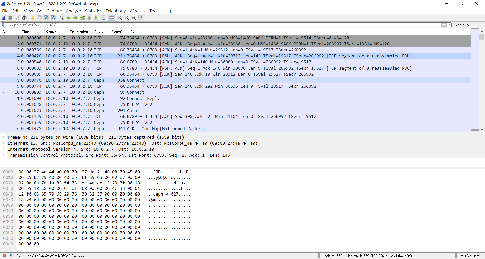

# Cephalopod (130 pts)

## 0. 題目
>We've found some strange networktraffic, we suspect it contains a flag.

PCAP嘛，當然要用wireshark解(?)

## 1. 正文

打開pcap

睇唔明，於是善用filter功能

發現竟然有flag.png，跟住就走去search PNG個header
>89 50 4E 47 0D 0A 1A 0A

又居然有
