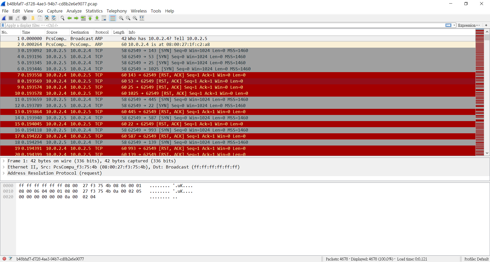

# simple_transfer (259 pts)

## 0. 題目
> The file contains a flag, find it.

PCAP我唔用wireshark解，又如何

## 1. 正文

Who has 10.0.2.4? No one cares.

邪魔外道之binwalk發現PDF file，extract

打開PDF，get flag
> HITB{b3d0e380e9c39352c667307d010775ca}

完。